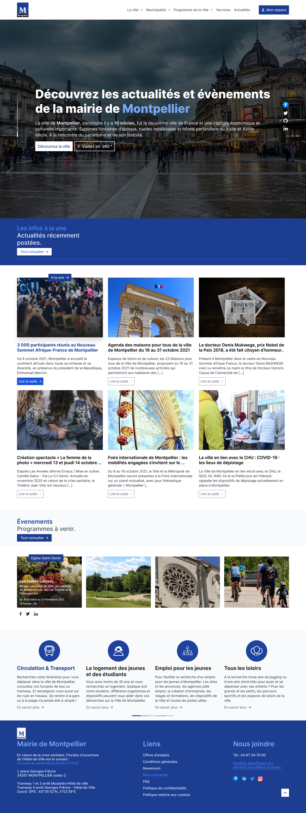

# integration-montpellier-website-landingpage

Integration of a model designed by [Johan Gaby](https://www.behance.net/mbagnajohan).

## Table of contents

- [Overview](#overview)
  - [Design](#design)
  - [Links](#links)
- [My process](#my-process)
  - [Built with](#built-with)
- [Author](#author)

### Design

### Links

- Figma URL : [click here](https://www.figma.com/file/uPvjGgwsvwKP1rcMyEFklc/RedesignMontpellierWebsite?node-id=0%3A1)
- Solution URL : [https://github.com/JuniorTachomTMCJ/redesign-montpellier-website.git](https://github.com/JuniorTachomTMCJ/redesign-montpellier-website.git)
- Live Site URL :

### Built with

- Tailwindscss
- Vanilla JS

## Author

- Frontend Mentor - [@JuniorTachomTMCJ](https://www.frontendmentor.io/profile/JuniorTachomTMCJ)
- Gith hub - [Junior Tachom](https://github.com/JuniorTachomTMCJ)
- Twitter - [@JuniorTachom](https://twitter.com/JuniorTachom)
